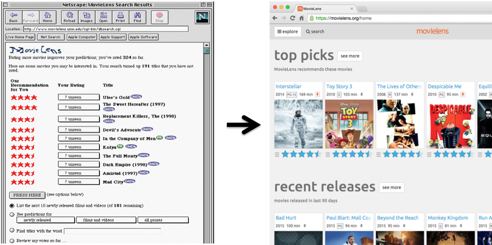

# Harvard Data Science Capstone: MovieLens

## 1. Project Overview
For this project, we will create a movie recommendation system using the MovieLens dataset. We will be creating our own
recommendation system using all the tools we have learned throughout the courses in this series.

---

## 2. Key Questions
- How can we familiarize ourselves with the MovieLens data?
- How can we train a machine learning algorithm to predict movie ratings in the validation set?

---

## 3. Installation and Setup

### Codes and Resourses

- **Editor:** RStudio 2026.07.0 Build 139
- **R Version:** R version 4.5.0
---
### R Packages Used
The following libraries and options are required to complete the assignment:
### $\color{red}{\text{TO BE ADDED LATER}}$
---

## 4. Data

### Source Data
The source data for this project is the [10M version](https://grouplens.org/datasets/movielens/10m/) of the MovieLens dataset to make the computation a little easier.

---

### Data Preprocessing
The source data is not presumed to meet [**tidy data** standards](https://cran.r-project.org/web/packages/tidyr/vignettes/tidy-data.html). Additional data wrangling will likely be required.

---

## 5. Project Structure

Project Repository structure is outlined below.
``` text
To be added later.
```
---
## 6. Results and Evaluation

### $\color{red}{\text{TO BE ADDED LATER}}$
---
## 7. Acknowledgements / References

### $\color{red}{\text{TO BE ADDED LATER}}$
---
